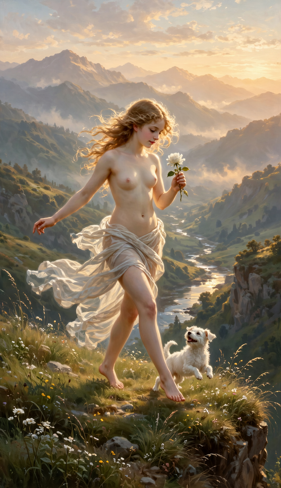

# cardstarot — Bộ Ẩn Chính từ prompt tiếng Việt

Ngày cập nhật: **05/09/2026**.

## Yêu cầu trang phục mới

The Magician, The High Priestess và The Empress cần **một dải lụa mỏng màu ngà tối giản, quấn gọn quanh eo và hông, ôm tự nhiên theo cơ thể**, không áo liền thân, không tay áo và không váy dài. Giữ tuổi trưởng thành, tóc, vai trò, bối cảnh và các đạo cụ riêng của từng lá.

**Vẫn dừng tạo ba ảnh theo lựa chọn của người dùng.** Lần thử trước khi bổ sung góc máy bị công cụ tạo ảnh chặn. Trong cập nhật này, người dùng chỉ yêu cầu thêm ngữ cảnh góc máy và xác nhận không tạo ảnh. Nội dung prompt cũ, ý tưởng và trang phục được giữ nguyên; chỉ nối thêm phần bố cục ở cuối. Bản có góc máy mới chưa được gửi cho công cụ tạo ảnh. Không có tác vụ tạo ảnh chạy ngầm.

Chưa có ảnh Magician/Priestess đáp ứng yêu cầu; bản sửa Empress còn váy dài và thêm phụ kiện trước đó đã bị loại khỏi đầu ra chính. Bản Empress đã chọn trước yêu cầu sửa trang phục vẫn được giữ riêng làm tham chiếu.

## Bổ sung góc máy — chỉ cập nhật prompt

| Lá | Góc nhìn bổ sung | Chi tiết phải giữ rõ |
|---|---|---|
| The Magician | Sau chếch trái, hơi cao, nhìn chéo xuống bàn tế | Tay giơ gậy, tay chỉ xuống; đúng bốn vật trên bàn |
| The High Priestess | Sau chếch phải, hơi cao nhìn vào lòng | Cuộn thư, voan trên đầu, hai cột đá, trăng bạc ở chân |
| The Empress | Sau chếch phải qua cạnh ngoài ngai | Vòng hoa, tay trên tay vịn, khăn lụa ngắn, khiên trái tim, lúa mì và trái cây |

- Mỗi file `*.next.txt` được nối thêm khối **GÓC MÁY VÀ BỐ CỤC**. Toàn bộ nội dung có trước khối này giữ nguyên từng byte; không rút gọn hay viết lại trang phục, nhân vật hoặc đạo cụ.
- Góc máy thay đổi phần thực sự nhìn thấy: quan sát từ lưng/vai và góc mặt nghiêng, không hiển thị mặt trước thân trên; lớp lụa ở hông vẫn đủ kín. Không thêm áo, váy dài, đạo cụ che hoặc phản chiếu.
- Đây là yêu cầu về bố cục không phô bày, không phải bảo đảm công cụ tạo ảnh sẽ chấp nhận hoặc thực hiện đúng. **Chưa tạo hoặc kiểm tra ảnh với phần bổ sung này.**
- `manifest.json` ghi hash và số byte của phần prompt trước khi bổ sung, hash của file mới và trạng thái `not_attempted` cho ngữ cảnh góc máy. Trạng thái dừng tạo ảnh vẫn được giữ.

## Tiến độ đầu ra chính

**Có ảnh hoàn tất trong thư mục chính: 1/22 lá Ẩn Chính — The Fool.**

| Lá | Ảnh hoàn tất | Prompt gốc + góc máy bổ sung | Trạng thái |
|---|---|---|---|
| 00 — THE FOOL | [00-fool.png](00-fool.png) | [Prompt đã dùng](00-fool.sent.txt) | PNG 784 × 1360, giữ nguyên |
| 01 — THE MAGICIAN | Chưa có | [01-magician.next.txt](01-magician.next.txt) | Đã dừng theo lựa chọn của người dùng |
| 02 — THE HIGH PRIESTESS | Chưa có | [02-priestess.next.txt](02-priestess.next.txt) | Đã dừng theo lựa chọn của người dùng |
| 03 — THE EMPRESS | Chưa có bản trang phục mới | [03-empress.next.txt](03-empress.next.txt) | Đã dừng; bản đã chọn trước được giữ làm tham chiếu |

Các lá 04–21 chưa được tạo trong thư mục này.

## Ảnh hiện có

## Bản Empress đã chọn trước

[Bản Empress trước yêu cầu lụa quấn eo](references/03-empress-before-waist-silk.png) được lưu riêng trong `references/`. Đây là ảnh mặc váy dài đã được chọn ở lượt trước, **không phải ảnh đáp ứng yêu cầu trang phục mới** và không được tính vào số ảnh hoàn tất ở trên. Bản tham chiếu được thu nhỏ từ 1568 × 2720 xuống 784 × 1360, giữ nguyên tỷ lệ và không thay trang phục.

## Nguồn và cách sử dụng prompt

- Bộ prompt tiếng Việt gốc: [prompts/out6_vi](../prompts/out6_vi/README.md).
- [Bản tổng hợp 78 prompt](../prompts/out6_vi/TAT-CA-78-PROMPT.md).
- Mục tiêu: PNG dọc **784 × 1360**, tranh phủ kín ảnh, **không khung và không chữ**.
- `*.next.txt` giữ nguyên bản mô tả render về trang phục và thêm ngữ cảnh góc máy ở cuối. Chưa có ảnh sinh từ phiên bản bổ sung góc máy. Các file không phải hàng đợi tự chạy; việc tạo ảnh vẫn dừng theo lựa chọn của người dùng.
- `*.sent.txt` lưu mô tả của các lượt trước, không tự động thay bằng `*.next.txt`. Không dùng các câu yêu cầu áo/váy dài trong prompt cũ để ghi đè yêu cầu mới.
- Magician: trên bàn tế phải có đúng bốn vật — một cốc, một kiếm, một gậy, một đồng tiền. Gậy đang giơ trên cao là đạo cụ riêng trong tay. Cần kiểm tra số lượng trực tiếp khi có ảnh.
- Priestess: giữ hai cột đá, voan trên đầu, cuộn thư trong lòng và trăng bạc dưới chân; voan không được biến thành áo choàng dài.
- Empress: giữ vòng hoa, ngai nhung, lúa mì, trái cây và khiên trái tim; không thêm quyền trượng hay vương miện ngôi sao.

## Bảo toàn dữ liệu

- Không thay thế ảnh trong `cards/`, `cards2/`, `cards3/`.
- The Fool trong thư mục này vẫn trùng byte với `cards_vi/00-fool.png`.
- Không sửa `cards.json`, bộ prompt tiếng Việt gốc, prompt tiếng Anh, chuẩn khung hoặc gallery mặc định.
- [manifest.json](manifest.json) ghi trạng thái thực tế, prompt được giữ nguyên và mã SHA-256 của các file liên quan.
