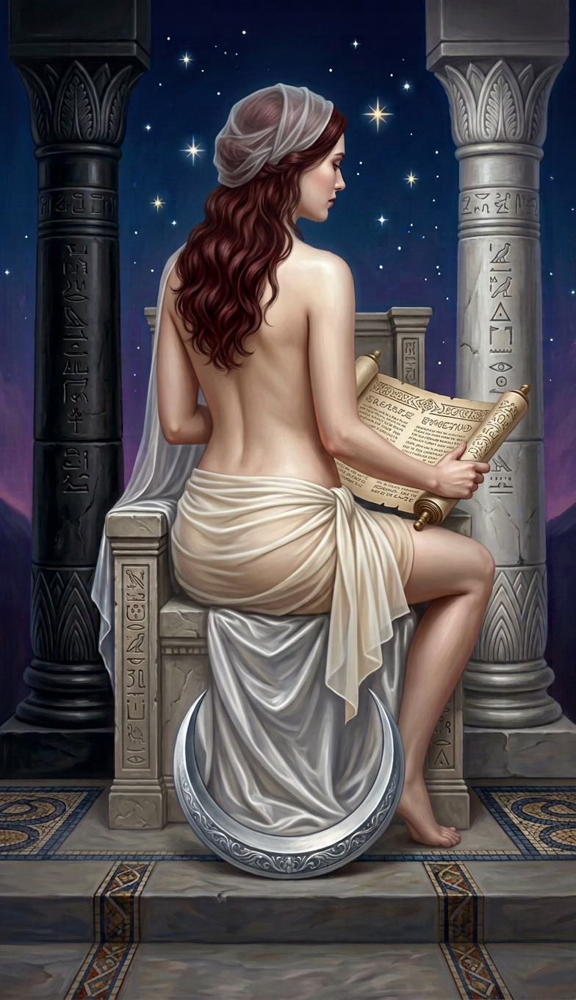

# cardstarot — Bộ 78 lá theo quy chuẩn dải lụa

Cập nhật **06/09/2026** · Quy chuẩn **waist-ribbon-v1**.

## Mẫu hướng tạo hình mới — chờ duyệt

Đã thêm [mẫu The Fool đứng chếch, nửa kín nửa hở](variants/00-fool-three-quarter-study.png). [Ghi chú mẫu](variants/00-fool-three-quarter-study.md) nêu rõ ảnh có thêm dải lụa che ngực/qua vai, khác quy chuẩn chỉ quấn eo/hông. **Mẫu chưa thay ảnh chính, chưa được áp dụng cho 69 lá người trưởng thành hoặc bộ 78 prompt.** Các ngoại lệ gia đình/biểu tượng giữ nguyên.

## Đã làm và phần còn lại

- **Đã chuẩn bị đủ 78 prompt** tiếng Việt trong [prompts/cardstarot_vi](../prompts/cardstarot_vi/README.md), có bản tổng hợp và bộ kiểm tra.
- **Đang có 4/78 ảnh theo hướng trang phục mới:** The Fool, The Magician, The High Priestess, The Empress. **Chưa tạo 74 ảnh còn lại.**
- Đợt ảnh chính trước tạo mới **Priestess và Empress**. **Fool dùng lại bản thử quấn lụa; Magician khôi phục bản góc sau đã có đúng kiểu quấn.** Không gọi hai bản tái sử dụng là ảnh mới sinh.
- Đợt tiếp theo: **04 — The Emperor, 05 — The Hierophant, 06 — The Lovers**. Mỗi đợt tối đa 3 lá; không có tác vụ tạo ảnh tự chạy ngầm.

## Quy chuẩn được áp dụng

- **69 lá người trưởng thành:** dải lụa ngà mỏng chỉ quấn eo/hông, phủ kín hạ thân và mông, có lớp lót màu da; góc nhìn/tóc/tư thế giữ phần thân trên không phô bày.
- **3 lá có trẻ em** (`cups-10`, `swords-06`, `pentacles-10`): tất cả người lớn và trẻ em mặc kín, giữ bối cảnh trung tính. Không dùng ảnh tham chiếu người quấn lụa của nhóm trưởng thành cho các lá này.
- **6 lá chỉ có biểu tượng hoặc bàn tay**: không thêm nhân vật hay trang phục chỉ để áp mẫu.
- Giữ vai trò, hành động, tuổi, tóc, các đạo cụ và **62 khóa số lượng nguyên văn**. Không đổi tất cả tư thế ngồi/cưỡi ngựa/treo ngược thành đứng.
- “95%” là **quy ước mô tả thị giác**, không phải độ xuyên sáng đã đo; lớp lót và phần cần che vẫn kín.
- Ảnh chính là PNG **784 × 1360**, tranh phủ kín ảnh, không khung hoặc tên lá. Các biểu tượng thuộc cảnh gốc được giữ, không thêm huy hiệu của lá tham chiếu.

[Quy chuẩn đầy đủ](../prompts/cardstarot_vi/STYLE.md) · [Toàn bộ 78 prompt](../prompts/cardstarot_vi/TAT-CA-78-PROMPT.md) · [Manifest prompt](../prompts/cardstarot_vi/manifest.json)

## Bốn lá hiện có

| 00 — The Fool | 01 — The Magician |
|---|---|
| [](00-fool.png) | [](01-magician.png) |

| 02 — The High Priestess | 03 — The Empress |
|---|---|
| [](02-priestess.png) | [](03-empress.png) |

### Ghi chú kiểm tra ảnh

- **Fool:** dùng nguyên ảnh quấn eo/hông từ `variants/00-fool-waist-ribbon.png`, nay áp vào ảnh chính. Giữ một bông hồng trắng, một chó trắng, vách đá và sông núi; không tạo lại ảnh này trong đợt.
- **Magician:** lần tạo mới không trả ảnh, nên dùng bản góc sau đã có trong `references/01-magician-before-front.png`. Đã kiểm tra đúng bốn vật trên bàn — cốc, kiếm, gậy, đồng tiền — và gậy trong tay riêng biệt. Phần lụa dài của bản chính diện trước đây không còn là ngoại lệ của quy chuẩn mới.
- **Priestess:** ảnh mới giữ tóc nâu đỏ, voan, hai cột, cuộn thư, trăng bạc và kiểu quấn hông. **Voan vẫn có đoạn thả dài theo ghế**, dài hơn gợi ý render chỉ phủ đầu; một chân bị ghế/voan che khuất. Ghi chú này được lưu để tiếp tục rà soát, không tuyên bố ảnh khớp tuyệt đối mọi chi tiết.
- **Empress:** ảnh mới nhìn từ sau/chếch, ngồi trên ngai nhung, tóc vàng kết vòng hoa, lụa quấn ngắn, khiên trái tim, lúa mì và trái cây. Nhân vật cầm một quả lựu thuộc nhóm trái cây trong cảnh.
- Kiểm tra định dạng và hash không thay thế việc duyệt giải phẫu bằng mắt. Không áp phép chấm khung vàng của bộ bài gốc cho phiên bản artwork-only.

## Prompt và dữ liệu

- `prompts/cardstarot_vi/*.txt` là bộ render thống nhất cho đủ 78 lá. Với bốn ảnh hiện có, `cardstarot/*.next.txt` là bản sao mô tả yêu cầu tương ứng.
- `cardstarot/*.sent.txt` lưu văn bản đã dùng để tạo ảnh hiện tại. Với ảnh tái sử dụng, đó là prompt của bản đã có, **không gán ngược prompt mới cho ảnh cũ**. Priestess dùng thêm hướng dẫn vai trò hai ảnh tham chiếu ở lần thử thành công.
- [manifest.json](manifest.json) liệt kê đủ 78 lá, profile, prompt, hash, nguồn ảnh, trạng thái đã có/chưa tạo và đợt tiếp theo.

```bash
python3 scripts/build_cardstarot_prompts_vi.py
python3 scripts/build_cardstarot_prompts_vi.py --check
python3 -m unittest discover -s tests -p 'test_cardstarot_*.py' -v
```

Bộ dựng chỉ ghi `prompts/cardstarot_vi/`, không gọi API tạo ảnh hoặc chỉnh dữ liệu nguồn. Không tự đồng bộ hay vẽ lại các ảnh còn thiếu khi chạy lệnh trên.

## Bảo toàn nguồn và lịch sử

- Không sửa `tarot prompt/cards.json`, `prompts/out6/`, `prompts/out6_vi/`, ảnh trong `cards/`, `cards2/`, `cards3/`, chuẩn khung hoặc gallery mặc định.
- The Fool trước đây vẫn giữ ở [cards_vi/00-fool.png](../cards_vi/00-fool.png). Bản chính trong `cardstarot/` nay đã đổi sang mẫu quấn lụa, không còn trùng với `cards_vi`.
- Các bản trước của bộ `cardstarot` vẫn nằm trong lịch sử Git, bao gồm [phiên bản trước quy chuẩn mới](https://github.com/caone1196-sketch/tarot-card/tree/eee750016f87b1c496bdccd5c1322fca4b335581/cardstarot). Mỗi ảnh được cập nhật có thông tin commit/đường dẫn cũ trong manifest.
- Những ảnh tham chiếu đã có trong `references/` vẫn giữ nguyên. Với các đợt lớn, dùng lịch sử Git để giữ phiên bản trước thay vì nhân đôi toàn bộ ảnh trong cây làm việc.

## Danh sách 78 lá

| STT | Lá / prompt mới | Profile | Ảnh và trạng thái |
|---|---|---|---|
| 1 | [THE FOOL](../prompts/cardstarot_vi/00-fool.txt) | Người lớn — lụa eo/hông | [PNG](00-fool.png) · tái sử dụng bản phù hợp |
| 2 | [THE MAGICIAN](../prompts/cardstarot_vi/01-magician.txt) | Người lớn — lụa eo/hông | [PNG](01-magician.png) · tái sử dụng bản phù hợp |
| 3 | [THE HIGH PRIESTESS](../prompts/cardstarot_vi/02-priestess.txt) | Người lớn — lụa eo/hông | [PNG](02-priestess.png) · mới; có ghi chú về voan |
| 4 | [THE EMPRESS](../prompts/cardstarot_vi/03-empress.txt) | Người lớn — lụa eo/hông | [PNG](03-empress.png) · mới |
| 5 | [THE EMPEROR](../prompts/cardstarot_vi/04-emperor.txt) | Người lớn — lụa eo/hông | Chưa tạo ảnh |
| 6 | [THE HIEROPHANT](../prompts/cardstarot_vi/05-hierophant.txt) | Người lớn — lụa eo/hông | Chưa tạo ảnh |
| 7 | [THE LOVERS](../prompts/cardstarot_vi/06-lovers.txt) | Người lớn — lụa eo/hông | Chưa tạo ảnh |
| 8 | [THE CHARIOT](../prompts/cardstarot_vi/07-chariot.txt) | Người lớn — lụa eo/hông | Chưa tạo ảnh |
| 9 | [STRENGTH](../prompts/cardstarot_vi/08-strength.txt) | Người lớn — lụa eo/hông | Chưa tạo ảnh |
| 10 | [THE HERMIT](../prompts/cardstarot_vi/09-hermit.txt) | Người lớn — lụa eo/hông | Chưa tạo ảnh |
| 11 | [WHEEL OF FORTUNE](../prompts/cardstarot_vi/10-wheel.txt) | Người lớn — lụa eo/hông | Chưa tạo ảnh |
| 12 | [JUSTICE](../prompts/cardstarot_vi/11-justice.txt) | Người lớn — lụa eo/hông | Chưa tạo ảnh |
| 13 | [THE HANGED](../prompts/cardstarot_vi/12-hanged.txt) | Người lớn — lụa eo/hông | Chưa tạo ảnh |
| 14 | [DEATH](../prompts/cardstarot_vi/13-death.txt) | Người lớn — lụa eo/hông | Chưa tạo ảnh |
| 15 | [TEMPERANCE](../prompts/cardstarot_vi/14-temperance.txt) | Người lớn — lụa eo/hông | Chưa tạo ảnh |
| 16 | [THE DEVIL](../prompts/cardstarot_vi/15-devil.txt) | Người lớn — lụa eo/hông | Chưa tạo ảnh |
| 17 | [THE TOWER](../prompts/cardstarot_vi/16-tower.txt) | Người lớn — lụa eo/hông | Chưa tạo ảnh |
| 18 | [THE STAR](../prompts/cardstarot_vi/17-the-star.txt) | Người lớn — lụa eo/hông | Chưa tạo ảnh |
| 19 | [THE MOON](../prompts/cardstarot_vi/18-moon.txt) | Người lớn — lụa eo/hông | Chưa tạo ảnh |
| 20 | [THE SUN](../prompts/cardstarot_vi/19-sun.txt) | Người lớn — lụa eo/hông | Chưa tạo ảnh |
| 21 | [JUDGEMENT](../prompts/cardstarot_vi/20-judgement.txt) | Người lớn — lụa eo/hông | Chưa tạo ảnh |
| 22 | [THE WORLD](../prompts/cardstarot_vi/21-world.txt) | Người lớn — lụa eo/hông | Chưa tạo ảnh |
| 23 | [ACE OF WANDS](../prompts/cardstarot_vi/wands-ace.txt) | Biểu tượng/bàn tay | Chưa tạo ảnh |
| 24 | [TWO OF WANDS](../prompts/cardstarot_vi/wands-02.txt) | Người lớn — lụa eo/hông | Chưa tạo ảnh |
| 25 | [THREE OF WANDS](../prompts/cardstarot_vi/wands-03.txt) | Người lớn — lụa eo/hông | Chưa tạo ảnh |
| 26 | [FOUR OF WANDS](../prompts/cardstarot_vi/wands-04.txt) | Người lớn — lụa eo/hông | Chưa tạo ảnh |
| 27 | [FIVE OF WANDS](../prompts/cardstarot_vi/wands-05.txt) | Người lớn — lụa eo/hông | Chưa tạo ảnh |
| 28 | [SIX OF WANDS](../prompts/cardstarot_vi/wands-06.txt) | Người lớn — lụa eo/hông | Chưa tạo ảnh |
| 29 | [SEVEN OF WANDS](../prompts/cardstarot_vi/wands-07.txt) | Người lớn — lụa eo/hông | Chưa tạo ảnh |
| 30 | [EIGHT OF WANDS](../prompts/cardstarot_vi/wands-08.txt) | Biểu tượng/bàn tay | Chưa tạo ảnh |
| 31 | [NINE OF WANDS](../prompts/cardstarot_vi/wands-09.txt) | Người lớn — lụa eo/hông | Chưa tạo ảnh |
| 32 | [TEN OF WANDS](../prompts/cardstarot_vi/wands-10.txt) | Người lớn — lụa eo/hông | Chưa tạo ảnh |
| 33 | [PAGE OF WANDS](../prompts/cardstarot_vi/wands-page.txt) | Người lớn — lụa eo/hông | Chưa tạo ảnh |
| 34 | [KNIGHT OF WANDS](../prompts/cardstarot_vi/wands-knight.txt) | Người lớn — lụa eo/hông | Chưa tạo ảnh |
| 35 | [QUEEN OF WANDS](../prompts/cardstarot_vi/wands-queen.txt) | Người lớn — lụa eo/hông | Chưa tạo ảnh |
| 36 | [KING OF WANDS](../prompts/cardstarot_vi/wands-king.txt) | Người lớn — lụa eo/hông | Chưa tạo ảnh |
| 37 | [ACE OF CUPS](../prompts/cardstarot_vi/cups-ace.txt) | Biểu tượng/bàn tay | Chưa tạo ảnh |
| 38 | [TWO OF CUPS](../prompts/cardstarot_vi/cups-02.txt) | Người lớn — lụa eo/hông | Chưa tạo ảnh |
| 39 | [THREE OF CUPS](../prompts/cardstarot_vi/cups-03.txt) | Người lớn — lụa eo/hông | Chưa tạo ảnh |
| 40 | [FOUR OF CUPS](../prompts/cardstarot_vi/cups-04.txt) | Người lớn — lụa eo/hông | Chưa tạo ảnh |
| 41 | [FIVE OF CUPS](../prompts/cardstarot_vi/cups-05.txt) | Người lớn — lụa eo/hông | Chưa tạo ảnh |
| 42 | [SIX OF CUPS](../prompts/cardstarot_vi/cups-06.txt) | Người lớn — lụa eo/hông | Chưa tạo ảnh |
| 43 | [SEVEN OF CUPS](../prompts/cardstarot_vi/cups-07.txt) | Người lớn — lụa eo/hông | Chưa tạo ảnh |
| 44 | [EIGHT OF CUPS](../prompts/cardstarot_vi/cups-08.txt) | Người lớn — lụa eo/hông | Chưa tạo ảnh |
| 45 | [NINE OF CUPS](../prompts/cardstarot_vi/cups-09.txt) | Người lớn — lụa eo/hông | Chưa tạo ảnh |
| 46 | [TEN OF CUPS](../prompts/cardstarot_vi/cups-10.txt) | Gia đình — mặc kín | Chưa tạo ảnh |
| 47 | [PAGE OF CUPS](../prompts/cardstarot_vi/cups-page.txt) | Người lớn — lụa eo/hông | Chưa tạo ảnh |
| 48 | [KNIGHT OF CUPS](../prompts/cardstarot_vi/cups-knight.txt) | Người lớn — lụa eo/hông | Chưa tạo ảnh |
| 49 | [QUEEN OF CUPS](../prompts/cardstarot_vi/cups-queen.txt) | Người lớn — lụa eo/hông | Chưa tạo ảnh |
| 50 | [KING OF CUPS](../prompts/cardstarot_vi/cups-king.txt) | Người lớn — lụa eo/hông | Chưa tạo ảnh |
| 51 | [ACE OF SWORDS](../prompts/cardstarot_vi/swords-ace.txt) | Biểu tượng/bàn tay | Chưa tạo ảnh |
| 52 | [TWO OF SWORDS](../prompts/cardstarot_vi/swords-02.txt) | Người lớn — lụa eo/hông | Chưa tạo ảnh |
| 53 | [THREE OF SWORDS](../prompts/cardstarot_vi/swords-03.txt) | Biểu tượng/bàn tay | Chưa tạo ảnh |
| 54 | [FOUR OF SWORDS](../prompts/cardstarot_vi/swords-04.txt) | Người lớn — lụa eo/hông | Chưa tạo ảnh |
| 55 | [FIVE OF SWORDS](../prompts/cardstarot_vi/swords-05.txt) | Người lớn — lụa eo/hông | Chưa tạo ảnh |
| 56 | [SIX OF SWORDS](../prompts/cardstarot_vi/swords-06.txt) | Gia đình — mặc kín | Chưa tạo ảnh |
| 57 | [SEVEN OF SWORDS](../prompts/cardstarot_vi/swords-07.txt) | Người lớn — lụa eo/hông | Chưa tạo ảnh |
| 58 | [EIGHT OF SWORDS](../prompts/cardstarot_vi/swords-08.txt) | Người lớn — lụa eo/hông | Chưa tạo ảnh |
| 59 | [NINE OF SWORDS](../prompts/cardstarot_vi/swords-09.txt) | Người lớn — lụa eo/hông | Chưa tạo ảnh |
| 60 | [TEN OF SWORDS](../prompts/cardstarot_vi/swords-10.txt) | Người lớn — lụa eo/hông | Chưa tạo ảnh |
| 61 | [PAGE OF SWORDS](../prompts/cardstarot_vi/swords-page.txt) | Người lớn — lụa eo/hông | Chưa tạo ảnh |
| 62 | [KNIGHT OF SWORDS](../prompts/cardstarot_vi/swords-knight.txt) | Người lớn — lụa eo/hông | Chưa tạo ảnh |
| 63 | [QUEEN OF SWORDS](../prompts/cardstarot_vi/swords-queen.txt) | Người lớn — lụa eo/hông | Chưa tạo ảnh |
| 64 | [KING OF SWORDS](../prompts/cardstarot_vi/swords-king.txt) | Người lớn — lụa eo/hông | Chưa tạo ảnh |
| 65 | [ACE OF PENTACLES](../prompts/cardstarot_vi/pentacles-ace.txt) | Biểu tượng/bàn tay | Chưa tạo ảnh |
| 66 | [TWO OF PENTACLES](../prompts/cardstarot_vi/pentacles-02.txt) | Người lớn — lụa eo/hông | Chưa tạo ảnh |
| 67 | [THREE OF PENTACLES](../prompts/cardstarot_vi/pentacles-03.txt) | Người lớn — lụa eo/hông | Chưa tạo ảnh |
| 68 | [FOUR OF PENTACLES](../prompts/cardstarot_vi/pentacles-04.txt) | Người lớn — lụa eo/hông | Chưa tạo ảnh |
| 69 | [FIVE OF PENTACLES](../prompts/cardstarot_vi/pentacles-05.txt) | Người lớn — lụa eo/hông | Chưa tạo ảnh |
| 70 | [SIX OF PENTACLES](../prompts/cardstarot_vi/pentacles-06.txt) | Người lớn — lụa eo/hông | Chưa tạo ảnh |
| 71 | [SEVEN OF PENTACLES](../prompts/cardstarot_vi/pentacles-07.txt) | Người lớn — lụa eo/hông | Chưa tạo ảnh |
| 72 | [EIGHT OF PENTACLES](../prompts/cardstarot_vi/pentacles-08.txt) | Người lớn — lụa eo/hông | Chưa tạo ảnh |
| 73 | [NINE OF PENTACLES](../prompts/cardstarot_vi/pentacles-09.txt) | Người lớn — lụa eo/hông | Chưa tạo ảnh |
| 74 | [TEN OF PENTACLES](../prompts/cardstarot_vi/pentacles-10.txt) | Gia đình — mặc kín | Chưa tạo ảnh |
| 75 | [PAGE OF PENTACLES](../prompts/cardstarot_vi/pentacles-page.txt) | Người lớn — lụa eo/hông | Chưa tạo ảnh |
| 76 | [KNIGHT OF PENTACLES](../prompts/cardstarot_vi/pentacles-knight.txt) | Người lớn — lụa eo/hông | Chưa tạo ảnh |
| 77 | [QUEEN OF PENTACLES](../prompts/cardstarot_vi/pentacles-queen.txt) | Người lớn — lụa eo/hông | Chưa tạo ảnh |
| 78 | [KING OF PENTACLES](../prompts/cardstarot_vi/pentacles-king.txt) | Người lớn — lụa eo/hông | Chưa tạo ảnh |
