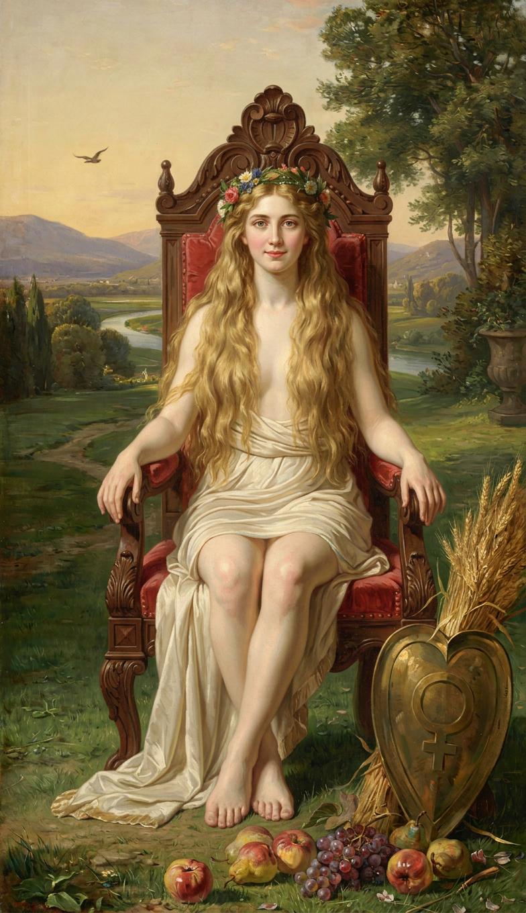

# cardstarot — Bộ Ẩn Chính từ prompt tiếng Việt

Ngày cập nhật: **05/09/2026**.

## Bản hiện tại: góc chính diện

The Magician và The Empress đã được tạo lại theo lựa chọn **góc nhìn chính diện**. Magician vẫn đứng; Empress vẫn ngồi trên ngai. Cả hai dùng tóc dài buông về phía trước để giữ bố cục kín đáo, không thêm áo ở phần trên.

**Riêng Magician: người dùng đã chấp nhận bản chính diện có lụa dài xuống chân.** Đây là lựa chọn được xác nhận, không phải tự thay khăn ngắn mà không thông báo.

| Lá | Ảnh hiện tại | Kích thước | Trạng thái |
|---|---|---|---|
| 00 — THE FOOL | [00-fool.png](00-fool.png) | PNG 784 × 1360 | Giữ nguyên |
| 01 — THE MAGICIAN | [01-magician.png](01-magician.png) | PNG 784 × 1360 | Chính diện, đứng; lụa dài đã được chấp nhận |
| 02 — THE HIGH PRIESTESS | Chưa có | — | Không nằm trong lượt sửa này; giữ trạng thái còn thiếu |
| 03 — THE EMPRESS | [03-empress.png](03-empress.png) | PNG 784 × 1360 | Chính diện, ngồi trên ngai |

Vẫn có **3/22 ảnh** trong thư mục chính. Lượt này thay hai ảnh hiện có, không tạo thêm lá mới và không tự tạo Priestess hoặc các lá 04–21. Không có tác vụ tạo ảnh chạy ngầm.

## Xem hai bản chính diện

| The Magician | The Empress |
|---|---|
|  |  |

## Kiểm tra và cách tạo

### The Magician

- Bản cuối được dựng mới từ mô tả sau khi thao tác đổi góc trên ảnh cũ không trả về ảnh; không phải xoay ảnh cũ bằng code.
- Giữ nhân vật trưởng thành 22 tuổi, tóc đen dài, tư thế một tay giơ gậy và tay kia chỉ xuống, vườn hoa hồng đen, bàn tế đá.
- Đã kiểm tra bằng mắt: có đúng **một cốc, một kiếm, một gậy và một đồng tiền** trên bàn; gậy trong tay là đạo cụ riêng. Không có khung hoặc tiêu đề.
- Tấm lụa dài là phiên bản người dùng đã chọn giữ. Prompt render cho riêng lá này được cập nhật theo lựa chọn đó; không áp dụng ngoại lệ lụa dài cho các lá chưa được yêu cầu.
- Ảnh sinh ra ở **952 × 1652**, được thu nhỏ theo tỷ lệ và chuẩn hóa về **784 × 1360**. Không cắt ghép lại cơ thể hoặc sửa đầu gậy trong bản chính diện này.

### The Empress

- Chỉnh từ bản đã chọn trước đó sang chính diện; vẫn ngồi, hai tay trên tay vịn, giữ vòng hoa, tóc vàng, ngai nhung, khiên trái tim, lúa mì và trái cây.
- Tóc buông phía trước che phần ngực. Nếp lụa và tà bên được giữ từ ảnh tham chiếu, không thay bằng một trang phục khác.
- Ảnh trả về đúng **784 × 1360**, chỉ chuẩn hóa PNG RGB. Góc chếch trước ở bản cũ đã được thay bằng chính diện.

## Các file prompt

| Lá | Prompt yêu cầu hiện tại | Văn bản dùng tạo bản hiện tại |
|---|---|---|
| The Magician | [01-magician.next.txt](01-magician.next.txt) | [01-magician.sent.txt](01-magician.sent.txt) |
| The High Priestess | [02-priestess.next.txt](02-priestess.next.txt) | [02-priestess.sent.txt](02-priestess.sent.txt) — lượt trước, chưa có ảnh |
| The Empress | [03-empress.next.txt](03-empress.next.txt) | [03-empress.sent.txt](03-empress.sent.txt) |

- Chỉ khối góc máy của Magician/Empress được chuyển sang chính diện. Mô tả lụa của Magician cũng được điều chỉnh ở file render riêng theo lựa chọn chấp nhận lụa dài.
- Nội dung gốc về tuổi, nhân vật, cảnh và đạo cụ của Empress trước phần góc máy vẫn được giữ nguyên. Với thao tác chỉnh ảnh Empress, trang phục thực tế theo bản tham chiếu đã chọn, gồm cả tà lụa bên.
- Với Magician và Empress, `*.sent.txt` lưu đúng văn bản của lần tạo thành công tương ứng; Magician là tạo từ văn bản, Empress là chỉnh ảnh có tham chiếu. File `.sent.txt` của Priestess vẫn ghi lượt trước chưa tạo được ảnh. `*.next.txt` là mô tả yêu cầu, không phải hàng đợi tự chạy.
- [manifest.json](manifest.json) ghi trạng thái, kích thước, hash, ảnh tham chiếu, cách hậu kỳ và lựa chọn lụa dài được xác nhận. Kiểm tra kỹ thuật không phải chứng nhận mọi chi tiết giải phẫu đều hoàn hảo.

## Giữ lại các bản trước

- [Magician trước khi đổi sang chính diện](references/01-magician-before-front.png) · [prompt của bản cũ](references/01-magician-before-front.sent.txt).
- [Empress trước khi đổi sang chính diện](references/03-empress-before-front.png) · [prompt của bản cũ](references/03-empress-before-front.sent.txt).
- [Magician nguyên gốc đã chọn ở lượt trước](references/01-magician-selected-original.png), trước bước hậu kỳ khổ bài của bản nhìn từ sau.
- [Empress váy dài của lượt trước nữa](references/03-empress-before-waist-silk.png).

Các bản trong `references/` không được tính thành lá mới.

## Bảo toàn nguồn

- [Bộ prompt tiếng Việt gốc](../prompts/out6_vi/README.md) và [bản tổng hợp 78 prompt](../prompts/out6_vi/TAT-CA-78-PROMPT.md) không thay đổi.
- Không sửa `tarot prompt/cards.json`, prompt tiếng Anh, ảnh trong `cards/`, `cards2/`, `cards3/`, chuẩn khung hoặc gallery mặc định.
- The Fool vẫn trùng byte với `cards_vi/00-fool.png`. Ảnh, prompt và metadata của Priestess không bị sửa trong lượt này.
- Tất cả ảnh chính giữ khổ **784 × 1360**, tranh phủ kín ảnh, không khung và không chữ; không áp dụng phép chấm viền vàng của bộ bài gốc.
