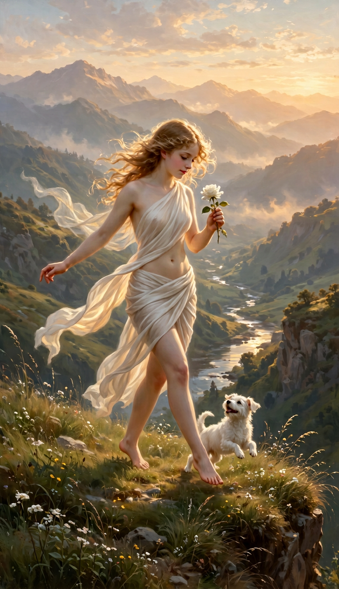

# The Fool — dải lụa theo ảnh và prompt gốc

Ngày tạo: **06/09/2026**. **Bản thử riêng để duyệt, chưa thay ảnh chính hoặc bộ 78 prompt.**

## Tham chiếu được dùng

- [Prompt do người dùng chỉ định](../../cards_vi/00-fool.sent.txt): lấy nhân vật, cảnh, ánh sáng bình minh, gió và yêu cầu không phô bày.
- [Ảnh The Fool tương ứng](../../cards_vi/00-fool.png): ảnh đầu vào thực sự của bước chỉnh hình.
- [Prompt mới đã gửi công cụ](00-fool-source-silk-study.sent.txt): bản diễn giải cho thao tác chỉnh lụa, **không phải gửi lại nguyên văn toàn bộ file gốc**.

File gốc chỉ nhắc lụa chuyển động theo gió và việc dùng tóc/tư thế/lụa để giữ kín, chưa định nghĩa rõ một dải vai–hông. Đường lụa liền mạch qua một vai, thân trước và hông là phần bổ sung theo yêu cầu mới.

## Bản thử hiện tại

- Giữ nhân vật trưởng thành, tóc vàng mật ong, dáng bước, mắt nhìn hoa, một bông hồng trắng và một chú chó trắng.
- Giữ cảnh vách đá, thung lũng, sông bạc, núi và ánh bình minh.
- Dải lụa trắng có đường nối qua vai–thân–hông, các nếp vải và phần đuôi bay theo gió; các vùng cần che được giữ kín.
- PNG RGB **784 × 1360**, không khung và không chữ; chỉ chuẩn hóa định dạng sau khi tạo, không kéo giãn hoặc cắt ghép cơ thể.

Không tuyên bố tỷ lệ xuyên sáng hay bề rộng vật liệu đo được từ ảnh. `cards_vi/00-fool.sent.txt`, ảnh trong `cards_vi`, ảnh chính trong `cardstarot` và bộ prompt dùng chung vẫn giữ nguyên.
