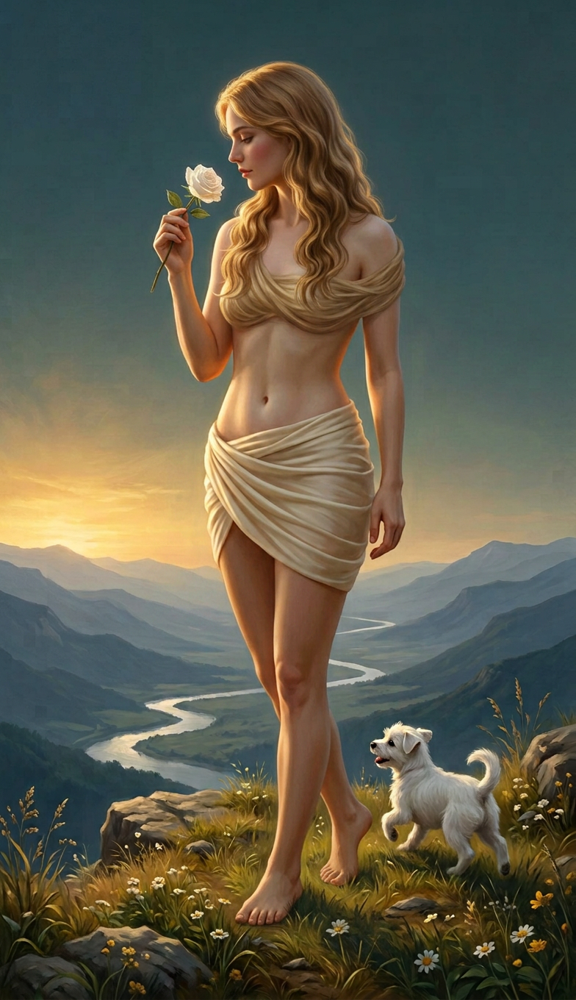

# The Fool — mẫu tư thế 3/4, nửa kín nửa hở

Ngày tạo: **06/09/2026**. **Bản thử để duyệt, chưa thay ảnh chính hoặc bộ 78 prompt.**

## Hướng thử

- Nhân vật trưởng thành đứng chếch về phía máy, vai/eo/chân thoáng, giữ bố cục không phô bày.
- Giữ tóc vàng mật ong, một bông hồng trắng, một chó trắng nhỏ và cảnh vách đá, sông núi.
- PNG RGB **784 × 1360**, không khung hoặc chữ. Không kéo giãn/cắt ghép cơ thể khi chuẩn hóa.

## Chi tiết cần duyệt

Ảnh trả về **có thêm dải lụa qua ngực và vai**, dù prompt yêu cầu dùng tóc che phần ngực và không thêm áo. Chi tiết này khác quy chuẩn dải lụa chỉ quấn eo/hông đang áp dụng cho bộ chính, nên không tự đưa vào quy chuẩn chung.

Góc 35–45 độ là hướng dẫn dựng hình, không phải góc máy đã đo từ ảnh. Mẫu này chỉ thử trên The Fool; không ép những lá đang ngồi, cưỡi ngựa hoặc treo ngược thành tư thế đứng.

[Prompt đã gửi](00-fool-three-quarter-study.sent.txt) · [Ảnh đầu vào](00-fool-waist-ribbon.png) · [Bộ chính hiện tại](../README.md).
