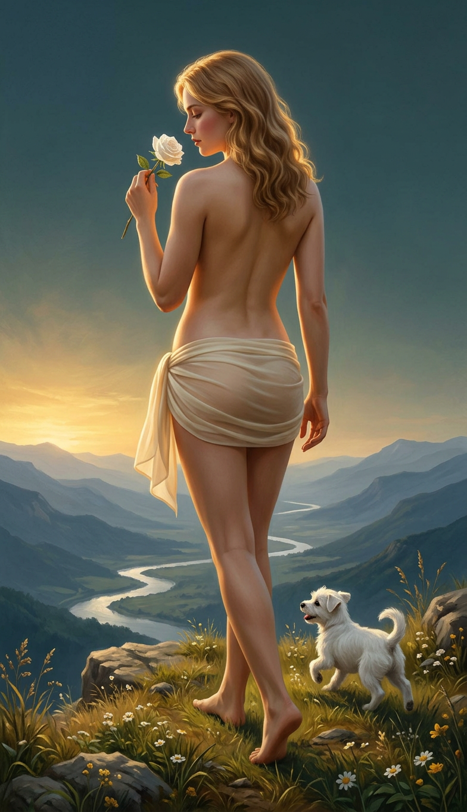

# The Fool — bản thử dải lụa quấn eo/hông

Ngày tạo: **06/09/2026**. Đây là **bản thử riêng**, chưa thay `cardstarot/00-fool.png`.

## Nội dung bản thử

- Dải lụa ngà chỉ quấn eo/hông, không nối lên thân trên và không thành áo/váy dài.
- Góc nhìn 3/4 từ sau; mặt trước thân trên không xuất hiện.
- Nhân vật trưởng thành theo dữ liệu The Fool, tóc vàng mật ong, nâng một bông hồng trắng; một chú chó trắng nhỏ bên gót chân, vách đá, núi và sông bạc.
- PNG RGB **784 × 1360**, không khung và không chữ. Chỉ chuẩn hóa định dạng, không kéo giãn hoặc cắt ghép cơ thể.

## Chất liệu

Prompt yêu cầu chiffon ngoài rất mỏng, với lớp lót màu da kín ở vùng hông/hạ thân. **“95%” là quy ước mô tả hiệu ứng, không phải độ xuyên sáng đã đo hoặc bảo đảm đạt trong ảnh.** Các nếp vải chồng và lớp lót vẫn đục; không coi toàn bộ trang phục là trong suốt 95%.

[Prompt đã dùng](00-fool-waist-ribbon.sent.txt). Ảnh tham chiếu thực sự: [Magician góc sau trong dự án](../references/01-magician-before-front.png), chỉ dùng cho chất tranh, góc nhìn và cách quấn lụa; không mang bàn tế hoặc gậy sang The Fool.

Ảnh chính The Fool, `cards_vi/00-fool.png`, các lá khác và toàn bộ dữ liệu nguồn vẫn giữ nguyên. Bản này được lưu để xem và so sánh trước khi quyết định áp dụng.
